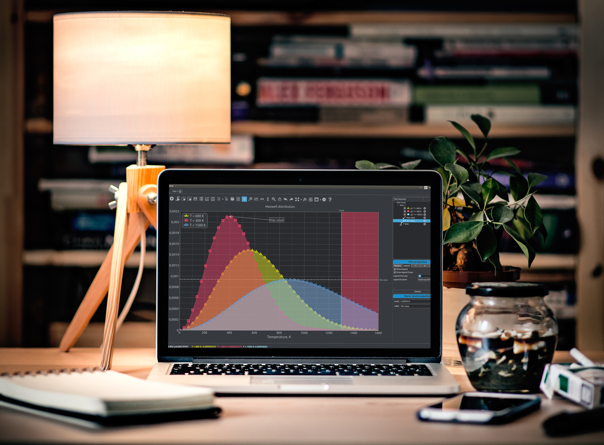

I am happy to announce first official jag [release](https://github.com/seleznevae/jag/releases). 

### Jag in a nutshell 

**Jag** is a simple graphing application which can be used to create simple 2D plots. No bar charts, 3D graphs, surfaces, maps... **Only simple 2D plots!** So according to one of UNIX principles it does only one thing, but tries to do it well. 

Jag was initially designed for engineers who spend a bunch of time analyzing results of mathematical modeling so that they can get most out of their data. So the main goal was to simplify and speed up graph creation and layout manipulations. It enables to create pretty nice plots in a few seconds. See [getting started](https://seleznevae.github.io/jag.org/getting-started/).

### Supported data formats 

At the moment *jag* supports data *.csv
format and data in simple table format. However, number of file formats that can be loaded may be extended by a user with custom plugins.

### Wishes

I hope you will like **jag** and find it useful in everyday routine work. Feel free to post your suggestions and bug reports at [github issues](https://github.com/seleznevae/jag/issues).

  <a class="btn btn-primary btn-lg get-started-btn" href="https://github.com/seleznevae/jag/releases">Download</a>

